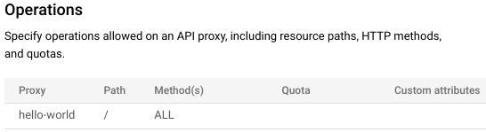

# marketplace-drupal-hello-world
Deploy a Drupal developer portal via GCP marketplace and expose a hello-world API

## Prereqs
This guide requires that you have a few things in place already:

- A provisioned Apigee X organization
- The default hello-world proxy deployed within your X org. If you do not have this proxy handy, you can find it's proxy bundle in the root of this repository at hello-world-open.zip

## Deploy your Drupal Portal via Marketplace
First we must deploy our Drupal portal to our GCP project via marketplace. This is a long running process so you can move on to the next section once you get it initializing.

1. Open your GCP Project
2. Navigate to Marketplace and find the Apigee Developer Portal Quickstart

3. Click launch and a enable any required APIs if needed
4. When configuring your new portal, keep default settings besides the following: a.) You may need to create a new service account (SA) with the needed permissions to run as the dev portal. Do so or add the permissions to an existing SA. b.) Enable HTTPS under Networking

## Create Apigee Product
Now we need to create a product on top of our hello-world proxy. Follow the steps below:

1. Navigate to the Apigee X Dashboard
2. Under Publish > API Products click the +CREATE button
3. Fill out the following fields --> Name: Hello World Product, Display Name: Hello World Product, Environment: up to you, Access: public, Operations: add new and then fill with the following information {API Proxy: hello-world, Path: /}

4. Save your API Product

## Configure Drupal Dev Portal
Now we will configure our Drupal Dev Portal with an admin account

1. Once your portal has finished initializing, access and sign into your app using the https link and the basic auth credentials. Note: if your portal has errors or does not load properly check Cloud Logging for details as it may fail silently with issues like org policy restrictions.

2. Verify details after sign in and complete Drupal installation
3. Configure the endpoint to reflect Apigee X and paste in your Apigee Org ID
4. Configure your site with the information and admin account of your chosing. Be sure that you have no typos when defining this information
5. Choose to install the Demo Content

## Add Hello World to your API Catalog
Now we will actually add Hello World Product to our Drupal API Catalog. This section takes within the Drupal portal and assumes that you are signed into your admin account. If you don't see the admin bar at the top of your site then sign in.

1. First, download the OpenAPI spec from this repository at hello-world-spec-open.yaml. Be sure to update the domain field in the yaml file with your own Apigee org domain
2. From the Drupal portal, navigate to Content > API Catalog
3. Click the "Add content" button
4. Fill in the info accordingly --> Name: Hello World, Description: A simple hello world API, Image: your choice, Specification Source Type: File, OpenAPI specification: upload your hello-world-spec-open.yaml, API Product: Hello World Product, Published: leave checked

5. Click save

## Verify Success
No all that's left to do is test your API directly from your Drupal portal!

1. Navigate to your Drupal portal Homepage. Scroll down to Featured APIs and select "View All APIs". Find your Hello World API and view it's documentation
2. Select the / GET call from under API REFERENCE. Under Try this API click EXECUTE
3. Voila! You have a working API documented within your Marketplace Drupal Portal!

## \[Optional\] Secure with API Key
Now we have a functional custom Drupal Portal promoting our Apigee X API, great! But in the real world we'll need to secure our APIs so let's take this demo a step further and update our API to require an API Key.

### Update Apigee Proxy Policy
1. Download the hello-world-secure.zip file from this repository
2. Go to your Apigee Dashboard > API Proxies > hello-world proxy > Develop
3. Select to import revision. Import the hello-world-secure.zip proxy bundle
4. Be sure to save and deploy your new revision

### Update API Product OpenAPI Doc in Drupal
1. Download the yaml file from this repostiory, hello-world-spec-secure.yaml. Update the hostname section with your API endpoint hostname.
2. From your Drupal Portal dashboard, navigate to Content > API Catelog > Edit Hello World
3. Under the Open API specification, upload the new OpenAPI spec that you just downloaded
4. Click save

### Create API App in Drupal
1. From the Drupal homepage, navigate to Apps. The button is in the navbar next to the My account and Log out buttons
2. Click the Add app button. Name your new app "Hello World Drupal App", leave Callback URL blank as well as the Description, finally make sure that the Hello World Product is selected.
3. Within your new Drupal App, copy the Consumer Key. You'll use this for authenticating into your API
4. Optional, view the corresponding App in Apigee by going to Apigee > Publish > Apps

### Test Secured API
1. Navigate to your Drupal portal Homepage. Scroll down to Featured APIs and select "View All APIs". Find your Hello World API and view it's documentation
2. From within the API select the "Authorize" button and save your API Key within
3. Select the / GET call from under API REFERENCE. Under Try this API click EXECUTE
4. Voila! You have a working API secured and documented within your Marketplace Drupal Portal!

## \[Optional\] Related Video Walkthrough

I also create a YouTube walkthrough using an example public sector use case, you can find it [here](https://www.youtube.com/watch?v=GeLqhPX9MPE). Also, the OpenAPI yaml file used in that video can be found at hello-world-spec-video.yaml.